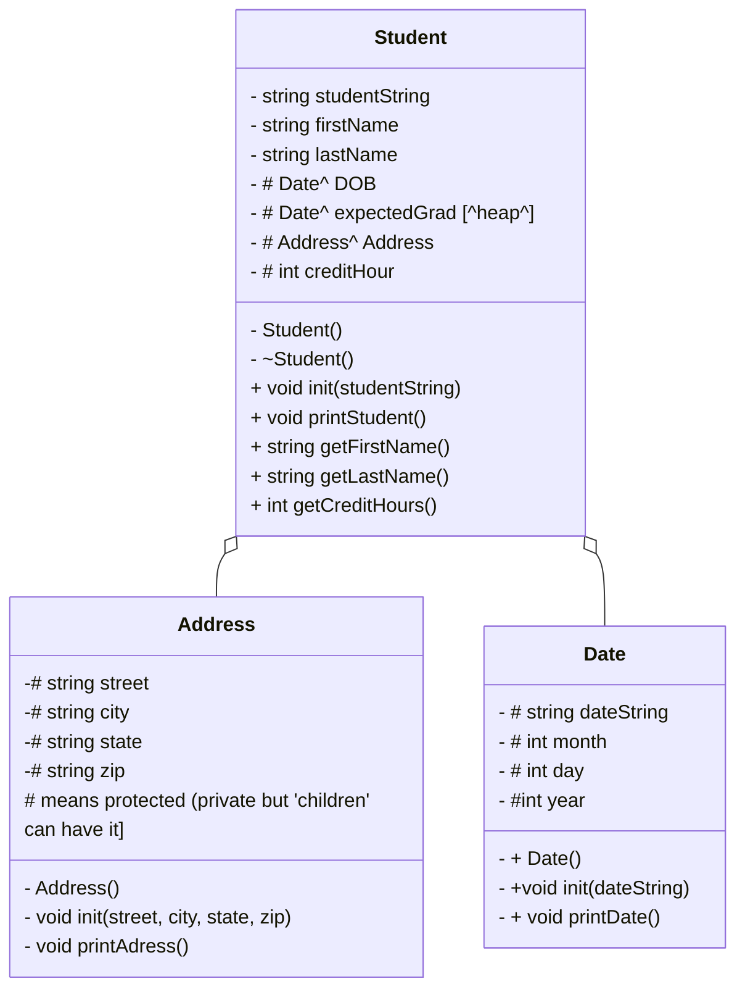

# HeapofStudents  

```mermaid 
classDiagram
    Student o-- Address
    Student o-- Date
    class Student{
        - string studentString
        - string firstName
        - string lastName
        - # Date^ DOB
        - # Date^ expectedGrad [^heap^]
        - # Address^ Address
        - # int creditHour

        - Student()
        - ~Student()
        + void init(studentString)
        + void printStudent()
        + string getFirstName()
        + string getLastName()
        + int getCreditHours()
           }
    class Address {
        -# string street
        -# string city
        -# string state
        -# string zip
        # means protected (private but 'children'
         can have it]
         - Address()
         - void init (street, city, state, zip)
         - void printAdress()

    }
    class Date{
        - # string dateString
        - # int month
        - # int day
        - #int year

        - + Date()
        - +void init(dateString)
        - + void printDate()
    }
```

