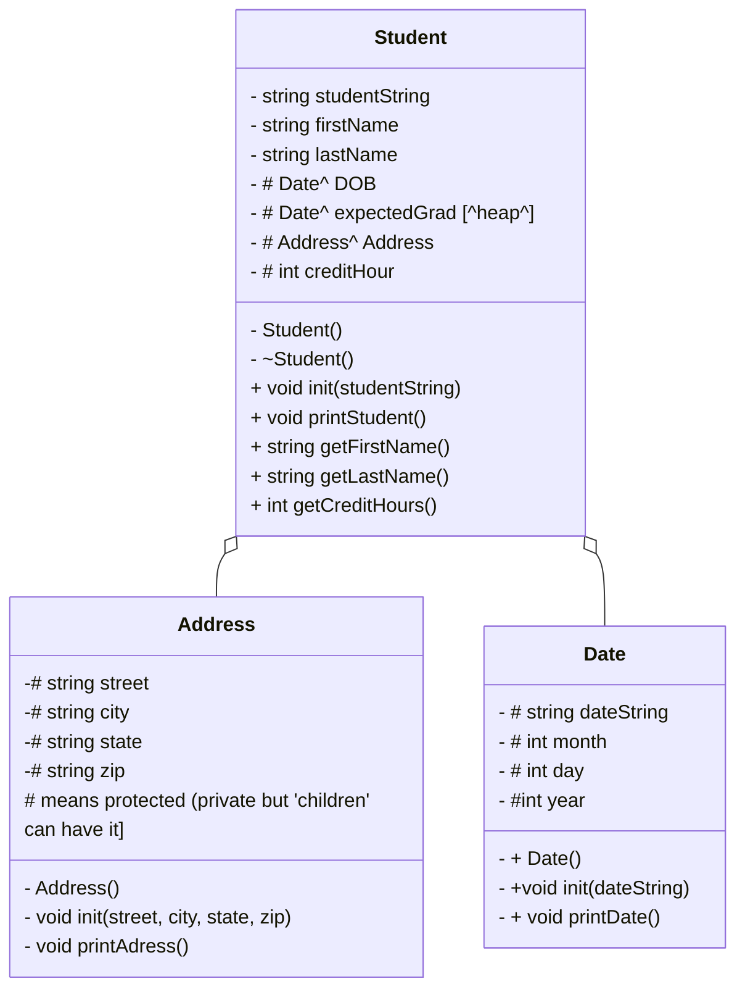

----------------------------------------------------------------------------------------------------------
# main

int main (){

std::string choice = "";

while choice != "0" {
    choice = menu()

    if choice == "1"  (choice == "1") {
        showStudentNames(students);
   } else if choice == "2"

# menu

int  menu(): 
    prints out the menu of options

0 quit 
1 print all student names
2 print all student data 
3 find a student 

returns a string representation of numberic input
no error checking needed

# loadStudent
 
    void loadStudents (reference to a vector of student pointers)
        create file input stream inFile
        create string currentLine

    open up inFile with students.csv

    read each line into currentLine
        create a new isntance of Student on the heap
        Call the student init method using currentLine
        push that student to the back of the vector

        close the input file

# showStudentNames
    void showStudentNames():
        given a reference to a vector of student pointers.
        go through vector one student at a time
        
        for each student:
            get first and last name and present it. print it
# printStudents

void printStudents():
    given a reference to a vector of student pointers
    go through the vector one student at a time
    for each student, Call that student's printStudent() method.

# findStudent
    void findStudent():
        given a reference to a vector of student pointers
        create a string target
        create a boolean notFound, initialize to true
        ask for last name, store in the target
            loop through all the students
                if the target is found in the Name field (string.find command)
                print the student data
            if the student isnt found:
                tell user.

# delStudents

    void delStudents():
        you'll need to delete the data on the students after you read them to avoid data leaking
loop through each element in the students vector
delete that element
pass vector by reference. 

------------------------------------------------------------------------------------------------
# HeapofStudents  

##Address Class

protected
std::string street
     string city
     string state
     string zip

public
Address()
void init (street, city, state, zip) parse by 

void printAddress
        print street << city << state << zip endl;

##Date Class

protected:
    std:: string dateString
         string month
        string year

public:
Date();
void init (string dateString)
void printDate(){
if month == 01 
    month = January
elif month == 02
    month = Feb
etc...

else:
 month = "invalid month"

print month << day << ", " << year
}

## Student class

protected:

...

public
Student()
~student()
init (studentSting)
printStudent(){
print fistName << lastName << address << "DOB:" << dob
 << "expected graduation:" << expectedGrad << "Credits:" << creditHours 
}

