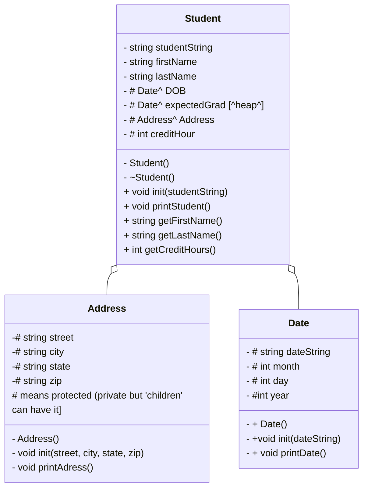

# HeapofStudents  

##Address Class

protected
std::string street
     string city
     string state
     string zip

public
Address()
void init (street, city, state, zip) parse by 

void printAddress
        print street << city << state << zip endl;

##Date Class

protected:
    std:: string dateString
         string month
        string year

public:
Date();
void init (string dateString)
void printDate(){
if month == 01 
    month = January
elif month == 02
    month = Feb
etc...

else:
 month = "invalid month"

print month << day << ", " << year
}

## Student class

protected:

...

public
Student()
~student()
init (studentSting)
printStudent(){
print fistName << lastName << address << "DOB:" << dob
 << "expected graduation:" << expectedGrad << "Credits:" << creditHours 
}

